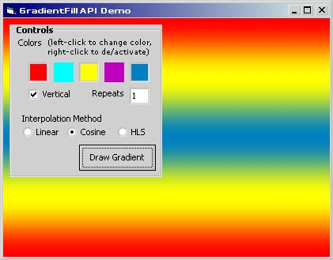



## Repeating, muticolor gradients \- oh my\!

### Description

**Yes, I propose we rename PSC to Planet-Gradient-Code! Like an infant I am oddly fascinated by pretty colors. In this submission I use the GradientFill API function to create horizontal and vertical repeating multicolor gradients. I also provide a custom gradient fill function to implement smoooooth cosine and tacky HLS (rainbow) color interpolation.

**No angle support, yet. For my stab at angled gradients see CodeID=59020.
 
### More Info
 

             |
---                |---
**Submitted On**   |2005-05-13 09:52:54
**By**             |[redbird77](https://github.com/Planet-Source-Code/PSCIndex/blob/master/ByAuthor/redbird77.md)
**Level**          |Intermediate
**User Rating**    |5.0 (20 globes from 4 users)
**Compatibility**  |VB 4\.0 \(32\-bit\), VB 5\.0, VB 6\.0
**Category**       |[Graphics](https://github.com/Planet-Source-Code/PSCIndex/blob/master/ByCategory/graphics__1-46.md)
**World**          |[Visual Basic](https://github.com/Planet-Source-Code/PSCIndex/blob/master/ByWorld/visual-basic.md)
**Archive File**   |[Repeating\_1887855132005\.zip](https://github.com/Planet-Source-Code/redbird77-repeating-muticolor-gradients-oh-my__1-60517/archive/master.zip)

